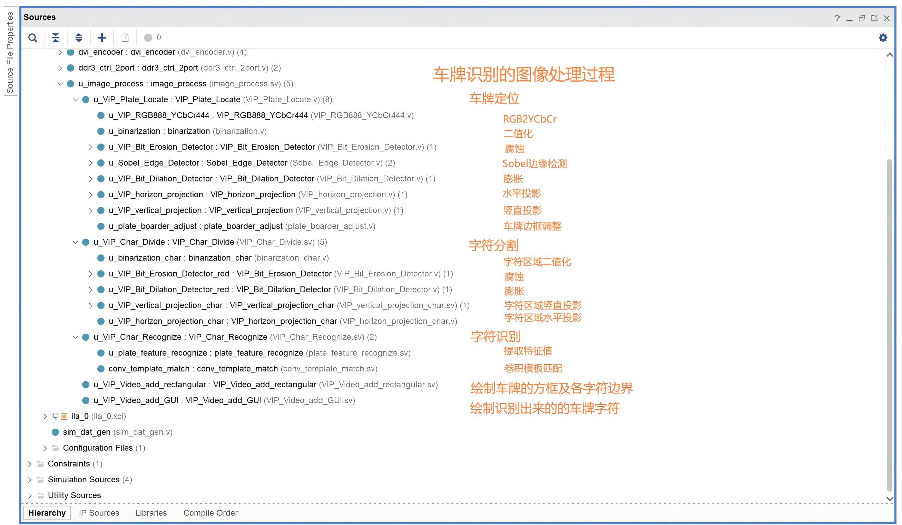

# fpga-license-plate-recognition
 FPGA车牌识别（卷积模板匹配）

------

基于FPGA实现卷积模板匹配的车牌识别

基于Verilog，开发软件为Vivado 2018.3，硬件平台为Xilinx FPGA开发板（XC7K325T）。

效果演示视频：[FPGA车牌识别（卷积模板匹配）_哔哩哔哩_bilibili](https://www.bilibili.com/video/BV1YaUxYoEm2/)

---

车牌识别过程中的图像处理相关代码

车牌识别过程的实现框图（直接搬运了Bilibili UP主“大磊FPGA”的框图）

.png)

---

注：

①本设计需要使用者准备好对应FPGA开发板的ucf文件，以确定DDR3的引脚分配

②本设计目前参考学习了bilibili UP主“大磊FPGA”、“小梅哥爱漂流”的教学视频、开源代码及资料，在此表示感谢！！

③车牌识别过程的教学视频[大磊FPGA的个人空间-大磊FPGA个人主页-哔哩哔哩视频](https://space.bilibili.com/597240022/channel/seriesdetail?sid=4166275)
